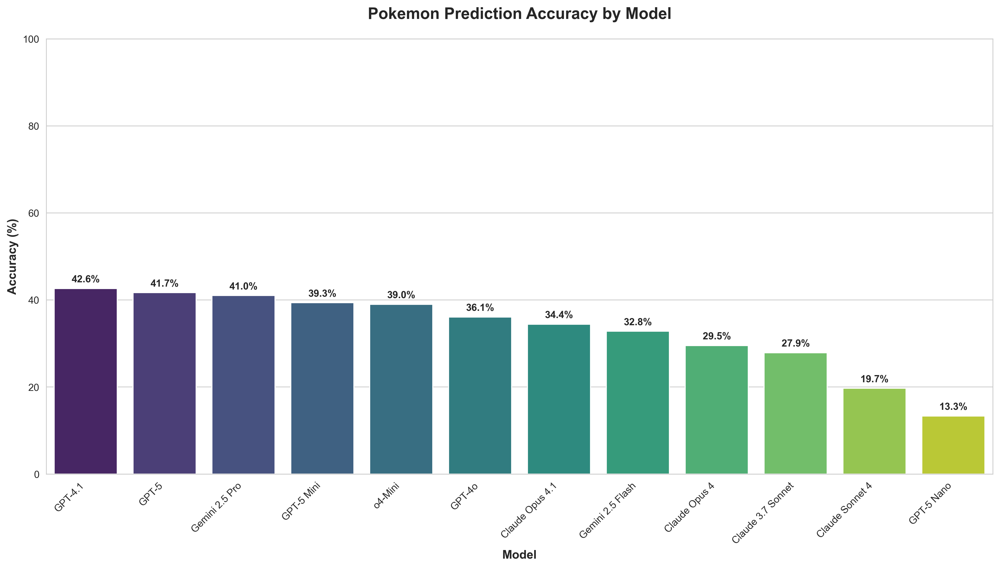
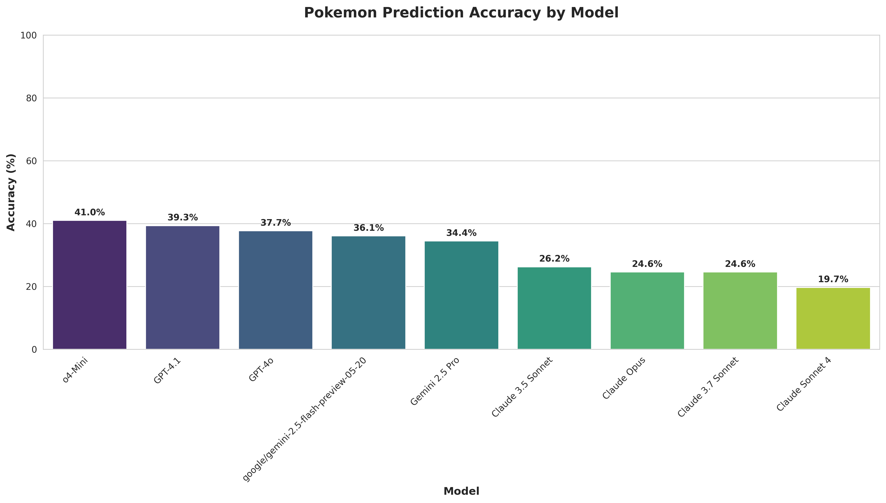

# PokeShadowBench

**Dataset:** [PokeShadowBench](https://huggingface.co/datasets/freddie/pokeshadowbench)

## Dataset Summary

This dataset contains silhouette images from the "Who's That Pokémon?" segments from the Pokémon anime series. Each entry includes:
- A silhouette image of a Pokémon
- The Pokédex number
- The name of the Pokémon

The dataset is focused on the Indigo League, and includes 61 Pokemon.

## Benchmark Overview

The "Who's That Pokémon?" benchmark evaluates multimodal language models on their ability to recognize Pokémon from silhouette images, replicating the classic challenge from the anime.

## How the Benchmark Works

### Task
Given a Pokémon silhouette image, predict the correct Pokémon species.

### Evaluation Metrics
- **Accuracy**: Percentage of correct predictions (1 attempt)

## Model Performance

### Overall Results

**Without Thinking / Reasoning:**


**With Thinking / Reasoning:**


### Individual Results

<details>
<summary><b>Without Thinking / Reasoning (click to expand)</b></summary>

| Pokemon | o4-Mini | GPT-4.1 | GPT-4o | Claude Opus | Claude Sonnet 4 | Claude 3.7 Sonnet | Claude 3.5 Sonnet | Gemini 2.5 Pro | google/gemini-2.5-flash-preview-05-20 |
|---------|---------|---------|--------|-------------|-----------------|-------------------|-------------------|----------------|---------------------------------------|
| abra | ❌ | ❌ | ❌ | ❌ | ❌ | ❌ | ❌ | ❌ | ❌ |
| aerodactyl | ❌ | ❌ | ❌ | ❌ | ❌ | ✅ | ✅ | ❌ | ✅ |
| alakazam | ❌ | ❌ | ❌ | ✅ | ✅ | ✅ | ❌ | ❌ | ❌ |
| arbok | ❌ | ❌ | ❌ | ❌ | ❌ | ❌ | ❌ | ❌ | ❌ |
| arcanine | ❌ | ❌ | ❌ | ❌ | ❌ | ❌ | ❌ | ✅ | ✅ |
| bellsprout | ❌ | ✅ | ❌ | ❌ | ❌ | ❌ | ❌ | ❌ | ✅ |
| bulbasaur | ✅ | ✅ | ✅ | ❌ | ❌ | ❌ | ✅ | ✅ | ❌ |
| butterfree | ✅ | ✅ | ✅ | ✅ | ✅ | ✅ | ✅ | ✅ | ✅ |
| caterpie | ❌ | ❌ | ✅ | ❌ | ❌ | ❌ | ❌ | ❌ | ❌ |
| charmander | ✅ | ✅ | ✅ | ❌ | ✅ | ✅ | ✅ | ✅ | ✅ |
| clefairy | ❌ | ❌ | ❌ | ❌ | ❌ | ❌ | ❌ | ❌ | ❌ |
| cloyster | ❌ | ❌ | ❌ | ✅ | ❌ | ❌ | ❌ | ❌ | ❌ |
| cubone | ❌ | ❌ | ✅ | ✅ | ❌ | ❌ | ❌ | ❌ | ✅ |
| diglett | ❌ | ❌ | ❌ | ✅ | ❌ | ✅ | ❌ | ❌ | ❌ |
| ditto | ✅ | ✅ | ✅ | ✅ | ✅ | ✅ | ✅ | ✅ | ✅ |
| eevee | ✅ | ✅ | ✅ | ❌ | ❌ | ❌ | ❌ | ✅ | ✅ |
| exeggcute | ✅ | ❌ | ❌ | ❌ | ❌ | ❌ | ❌ | ❌ | ❌ |
| farfetchd | ❌ | ❌ | ❌ | ❌ | ❌ | ❌ | ❌ | ❌ | ❌ |
| fearow | ❌ | ❌ | ❌ | ❌ | ❌ | ❌ | ❌ | ❌ | ❌ |
| gastly | ❌ | ❌ | ❌ | ❌ | ❌ | ❌ | ❌ | ❌ | ❌ |
| gengar | ❌ | ❌ | ❌ | ❌ | ✅ | ✅ | ❌ | ✅ | ✅ |
| geodude | ✅ | ✅ | ✅ | ✅ | ❌ | ❌ | ❌ | ✅ | ❌ |
| gloom | ✅ | ❌ | ❌ | ❌ | ❌ | ❌ | ❌ | ❌ | ❌ |
| growlithe | ✅ | ✅ | ✅ | ❌ | ✅ | ❌ | ❌ | ✅ | ❌ |
| haunter | ✅ | ❌ | ❌ | ✅ | ❌ | ❌ | ❌ | ✅ | ❌ |
| hitmonchan | ❌ | ❌ | ❌ | ❌ | ❌ | ❌ | ❌ | ❌ | ❌ |
| horsea | ✅ | ✅ | ✅ | ❌ | ❌ | ❌ | ❌ | ✅ | ✅ |
| ivysaur | ❌ | ❌ | ❌ | ✅ | ❌ | ❌ | ✅ | ❌ | ❌ |
| jigglypuff | ✅ | ✅ | ✅ | ✅ | ✅ | ✅ | ✅ | ❌ | ✅ |
| jynx | ✅ | ✅ | ✅ | ❌ | ❌ | ❌ | ❌ | ❌ | ❌ |
| kabutops | ✅ | ❌ | ❌ | ❌ | ❌ | ✅ | ✅ | ❌ | ❌ |
| kangaskhan | ❌ | ❌ | ❌ | ❌ | ❌ | ❌ | ❌ | ❌ | ❌ |
| koffing | ✅ | ❌ | ❌ | ✅ | ❌ | ❌ | ❌ | ✅ | ✅ |
| krabby | ❌ | ❌ | ✅ | ✅ | ❌ | ✅ | ✅ | ✅ | ✅ |
| magikarp | ✅ | ❌ | ❌ | ❌ | ❌ | ❌ | ❌ | ✅ | ✅ |
| magmar | ❌ | ❌ | ❌ | ❌ | ❌ | ❌ | ❌ | ❌ | ❌ |
| magnemite | ✅ | ✅ | ✅ | ❌ | ❌ | ❌ | ✅ | ❌ | ❌ |
| metapod | ❌ | ❌ | ❌ | ❌ | ❌ | ❌ | ❌ | ❌ | ❌ |
| moltres | ❌ | ❌ | ❌ | ❌ | ❌ | ❌ | ❌ | ❌ | ❌ |
| mr | ❌ | ❌ | ❌ | ❌ | ❌ | ❌ | ❌ | ❌ | ❌ |
| nidoran♂ | ❌ | ❌ | ❌ | ❌ | ❌ | ❌ | ❌ | ❌ | ❌ |
| onix | ✅ | ✅ | ❌ | ❌ | ❌ | ✅ | ✅ | ✅ | ✅ |
| paras | ✅ | ✅ | ❌ | ❌ | ❌ | ❌ | ❌ | ❌ | ❌ |
| pidgeotto | ❌ | ✅ | ❌ | ❌ | ❌ | ❌ | ❌ | ❌ | ✅ |
| pikachu | ✅ | ✅ | ✅ | ✅ | ✅ | ✅ | ✅ | ✅ | ✅ |
| ponyta | ✅ | ❌ | ✅ | ✅ | ❌ | ❌ | ❌ | ✅ | ❌ |
| primeape | ❌ | ❌ | ❌ | ❌ | ❌ | ❌ | ❌ | ❌ | ❌ |
| psyduck | ✅ | ✅ | ✅ | ✅ | ✅ | ❌ | ❌ | ✅ | ✅ |
| raichu | ❌ | ✅ | ✅ | ✅ | ❌ | ✅ | ✅ | ✅ | ✅ |
| raticate | ❌ | ✅ | ✅ | ✅ | ❌ | ❌ | ❌ | ✅ | ❌ |
| sandshrew | ❌ | ✅ | ❌ | ❌ | ❌ | ❌ | ❌ | ❌ | ❌ |
| scyther | ❌ | ❌ | ❌ | ❌ | ❌ | ✅ | ❌ | ✅ | ❌ |
| seaking | ❌ | ❌ | ❌ | ❌ | ❌ | ❌ | ❌ | ❌ | ❌ |
| seel | ❌ | ❌ | ❌ | ❌ | ❌ | ❌ | ✅ | ❌ | ✅ |
| slowbro | ❌ | ❌ | ✅ | ❌ | ❌ | ❌ | ❌ | ❌ | ❌ |
| snorlax | ✅ | ✅ | ✅ | ✅ | ✅ | ❌ | ❌ | ✅ | ✅ |
| squirtle | ✅ | ✅ | ✅ | ✅ | ✅ | ✅ | ✅ | ✅ | ✅ |
| venonat | ✅ | ✅ | ✅ | ✅ | ✅ | ✅ | ✅ | ❌ | ❌ |
| vileplume | ❌ | ❌ | ❌ | ❌ | ✅ | ❌ | ❌ | ❌ | ❌ |
| vulpix | ❌ | ✅ | ✅ | ❌ | ❌ | ❌ | ❌ | ✅ | ❌ |
| wartortle | ❌ | ❌ | ❌ | ❌ | ❌ | ❌ | ❌ | ❌ | ❌ |

</details>


<details>
<summary><b>With Thinking / Reasoning Results (click to expand)</b></summary>

| Pokemon | o4-Mini | GPT-4.1 | GPT-4o | Claude Opus | Claude Sonnet 4 | Claude 3.7 Sonnet | Claude 3.5 Sonnet | Gemini 2.5 Pro | google/gemini-2.5-flash-preview-05-20 |
|---------|---------|---------|--------|-------------|-----------------|-------------------|-------------------|----------------|---------------------------------------|
| abra | ❌ | ❌ | ❌ | ❌ | ❌ | ❌ | ❌ | ❌ | ❌ |
| aerodactyl | ❌ | ❌ | ❌ | ❌ | ❌ | ❌ | ❌ | ❌ | ✅ |
| alakazam | ❌ | ❌ | ❌ | ✅ | ❌ | ❌ | ❌ | ❌ | ❌ |
| arbok | ❌ | ❌ | ❌ | ❌ | ❌ | ❌ | ❌ | ❌ | ❌ |
| arcanine | ❌ | ✅ | ❌ | ❌ | ❌ | ❌ | ❌ | ✅ | ✅ |
| bellsprout | ✅ | ✅ | ✅ | ❌ | ❌ | ❌ | ❌ | ❌ | ❌ |
| bulbasaur | ❌ | ✅ | ❌ | ✅ | ❌ | ✅ | ✅ | ✅ | ✅ |
| butterfree | ✅ | ✅ | ✅ | ✅ | ✅ | ✅ | ✅ | ✅ | ✅ |
| caterpie | ❌ | ❌ | ✅ | ❌ | ❌ | ❌ | ❌ | ❌ | ❌ |
| charmander | ✅ | ✅ | ✅ | ✅ | ✅ | ✅ | ✅ | ✅ | ✅ |
| clefairy | ❌ | ❌ | ❌ | ❌ | ❌ | ❌ | ❌ | ❌ | ❌ |
| cloyster | ✅ | ❌ | ❌ | ❌ | ❌ | ❌ | ❌ | ❌ | ❌ |
| cubone | ❌ | ❌ | ❌ | ✅ | ❌ | ❌ | ❌ | ❌ | ✅ |
| diglett | ❌ | ❌ | ❌ | ❌ | ❌ | ❌ | ❌ | ❌ | ❌ |
| ditto | ✅ | ✅ | ✅ | ✅ | ✅ | ✅ | ✅ | ✅ | ✅ |
| eevee | ✅ | ✅ | ✅ | ❌ | ✅ | ❌ | ❌ | ✅ | ✅ |
| exeggcute | ✅ | ❌ | ❌ | ❌ | ❌ | ❌ | ❌ | ❌ | ❌ |
| farfetchd | ❌ | ❌ | ❌ | ❌ | ❌ | ❌ | ❌ | ❌ | ❌ |
| fearow | ❌ | ❌ | ❌ | ❌ | ❌ | ❌ | ❌ | ❌ | ❌ |
| gastly | ❌ | ❌ | ❌ | ❌ | ❌ | ❌ | ❌ | ❌ | ❌ |
| gengar | ✅ | ❌ | ❌ | ❌ | ✅ | ✅ | ✅ | ✅ | ❌ |
| geodude | ✅ | ✅ | ✅ | ❌ | ❌ | ❌ | ❌ | ✅ | ✅ |
| gloom | ❌ | ❌ | ❌ | ❌ | ❌ | ❌ | ❌ | ❌ | ❌ |
| growlithe | ✅ | ✅ | ✅ | ❌ | ✅ | ❌ | ❌ | ❌ | ✅ |
| haunter | ✅ | ❌ | ❌ | ❌ | ❌ | ❌ | ❌ | ❌ | ❌ |
| hitmonchan | ❌ | ❌ | ❌ | ❌ | ❌ | ❌ | ❌ | ❌ | ❌ |
| horsea | ✅ | ✅ | ✅ | ✅ | ❌ | ❌ | ❌ | ❌ | ✅ |
| ivysaur | ❌ | ❌ | ❌ | ❌ | ❌ | ❌ | ❌ | ❌ | ❌ |
| jigglypuff | ✅ | ✅ | ✅ | ✅ | ✅ | ✅ | ✅ | ❌ | ✅ |
| jynx | ❌ | ✅ | ✅ | ❌ | ❌ | ❌ | ❌ | ❌ | ✅ |
| kabutops | ✅ | ❌ | ❌ | ❌ | ❌ | ✅ | ✅ | ❌ | ❌ |
| kangaskhan | ❌ | ❌ | ❌ | ❌ | ❌ | ❌ | ❌ | ❌ | ❌ |
| koffing | ✅ | ❌ | ❌ | ✅ | ❌ | ❌ | ❌ | ✅ | ❌ |
| krabby | ✅ | ❌ | ✅ | ✅ | ❌ | ✅ | ✅ | ✅ | ❌ |
| magikarp | ❌ | ❌ | ❌ | ❌ | ❌ | ❌ | ❌ | ✅ | ✅ |
| magmar | ❌ | ❌ | ❌ | ❌ | ❌ | ❌ | ❌ | ❌ | ❌ |
| magnemite | ✅ | ✅ | ✅ | ❌ | ❌ | ❌ | ✅ | ❌ | ❌ |
| metapod | ❌ | ❌ | ❌ | ❌ | ❌ | ❌ | ❌ | ❌ | ❌ |
| moltres | ✅ | ❌ | ❌ | ❌ | ❌ | ❌ | ❌ | ❌ | ❌ |
| mr | ❌ | ❌ | ❌ | ❌ | ❌ | ❌ | ❌ | ❌ | ❌ |
| nidoran♂ | ❌ | ❌ | ❌ | ❌ | ❌ | ❌ | ❌ | ❌ | ❌ |
| onix | ✅ | ✅ | ❌ | ❌ | ❌ | ✅ | ✅ | ✅ | ✅ |
| paras | ❌ | ✅ | ❌ | ❌ | ❌ | ❌ | ❌ | ❌ | ❌ |
| pidgeotto | ❌ | ❌ | ❌ | ❌ | ❌ | ❌ | ❌ | ❌ | ❌ |
| pikachu | ✅ | ✅ | ✅ | ✅ | ✅ | ✅ | ✅ | ✅ | ✅ |
| ponyta | ❌ | ❌ | ✅ | ❌ | ❌ | ✅ | ❌ | ✅ | ❌ |
| primeape | ❌ | ❌ | ❌ | ❌ | ❌ | ❌ | ❌ | ✅ | ✅ |
| psyduck | ✅ | ✅ | ✅ | ✅ | ✅ | ❌ | ❌ | ✅ | ✅ |
| raichu | ❌ | ✅ | ✅ | ❌ | ❌ | ✅ | ✅ | ✅ | ✅ |
| raticate | ✅ | ✅ | ✅ | ✅ | ❌ | ❌ | ❌ | ✅ | ✅ |
| sandshrew | ❌ | ✅ | ❌ | ❌ | ❌ | ❌ | ❌ | ❌ | ❌ |
| scyther | ❌ | ❌ | ❌ | ❌ | ❌ | ✅ | ❌ | ✅ | ❌ |
| seaking | ❌ | ❌ | ❌ | ❌ | ❌ | ❌ | ❌ | ❌ | ❌ |
| seel | ❌ | ❌ | ❌ | ❌ | ❌ | ❌ | ✅ | ❌ | ❌ |
| slowbro | ✅ | ❌ | ✅ | ❌ | ❌ | ❌ | ❌ | ❌ | ❌ |
| snorlax | ❌ | ✅ | ✅ | ❌ | ✅ | ❌ | ✅ | ✅ | ✅ |
| squirtle | ✅ | ✅ | ✅ | ✅ | ✅ | ✅ | ✅ | ❌ | ✅ |
| venonat | ✅ | ✅ | ✅ | ✅ | ✅ | ✅ | ✅ | ❌ | ❌ |
| vileplume | ❌ | ❌ | ❌ | ❌ | ❌ | ❌ | ❌ | ❌ | ❌ |
| vulpix | ❌ | ✅ | ✅ | ❌ | ❌ | ❌ | ❌ | ✅ | ❌ |
| wartortle | ❌ | ❌ | ❌ | ❌ | ❌ | ❌ | ❌ | ❌ | ❌ |

</details>

### Individual Predictions


## Setup

1. Install dependencies
```
pip install -r requirements.txt
```

2. Set your API keys in your environment
```
export OPENAI_API_KEY=<your_openai_api_key>
export ANTHROPIC_API_KEY=<your_anthropic_api_key>
export GEMINI_API_KEY=<your_gemini_api_key>
```


## Usage

### Basic Usage
```bash
python src/evaluate_llms.py
```

### Test Specific Prompts Only (`prompts.yaml`)
```bash
python src/evaluate_llms.py --prompts default indigo_hint think_and_reflect
```

### With Custom Prompts File
```bash
python src/evaluate_llms.py --prompts-file my_prompts.yaml
```

### Enable Thinking Models
```bash
python src/evaluate_llms.py --with-thinking
```

### Sequential Processing
If you want to test models one at a time, or need to debug a specific model, you can run the script in sequential mode.

```bash
python evaluate_llms.py --sequential
```

## YAML Configuration

Edit the `prompts.yaml` file with your prompt variations:

```yaml
prompts:
  default:
    name: "Default Who's That Pokemon"
    prompt: "Let's play a game called \"Who's that Pokemon?\". You will be given a silhouette of a Pokemon. Your job is to guess the Pokemon name. Respond with ONLY the Pokemon name, nothing else."
```


